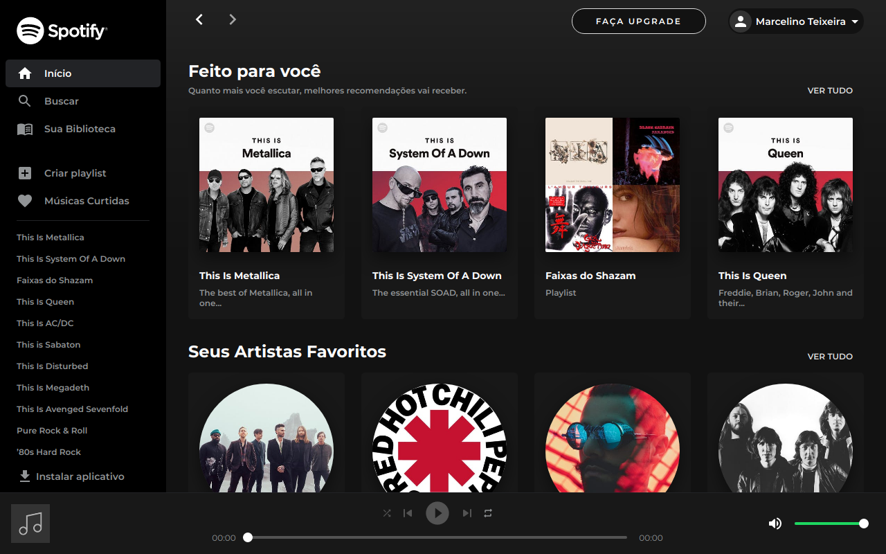

<h1 align="center">
  
</h1>

  <a href="#-tecnologias">Tecnologias</a>&nbsp;&nbsp;&nbsp;|&nbsp;&nbsp;&nbsp;
  <a href="#-projeto">Projeto</a>&nbsp;&nbsp;&nbsp;|&nbsp;&nbsp;&nbsp;
  <a href="#-como-executar">Como executar</a>

 

  

## 🚀 Tecnologias

Esse projeto foi desenvolvido com as seguintes tecnologias:

- [React](https://reactjs.org)
- [Next.js](https://nextjs.org)
- [TypeScript](https://www.typescriptlang.org)
- [Sass](https://sass-lang.com/)

## 💻 Projeto

<h4> Acesse em: https://spotify-ui-clone.vercel.app </h4>

O projeto consiste em um clone da interface do Web Player do [Spotify](https://open.spotify.com), conectando com a API do Spotify para popular o site.

## 🚀 Funcionalidades

- `UI Clone` de várias telas do Spotify
- Conexão com a `API do Spotify` para pegar informações de músicas, artistas, etc.
- `Player de música` com controles personalizados que pega as amostras de 30 segundos liberadas pelo Spotify
- Mecanismo de busca `com debounce` que pega dados de músicas, artistas, álbuns e paylists

## 🚀 Como executar

- Clone o repositório
- Instale as dependências com `yarn`
- Inicie o servidor com `yarn dev`

Agora você pode acessar [`localhost:3000`](http://localhost:3000) do seu navegador.

---

<h4 align="center"> Feito com ♥ por Marcelino Teixeira </h4>
